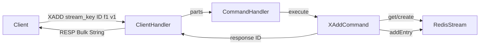

# Requirements

### Overview & Goals
The goal is to implement the `XADD` command logic in the Redis server. This involves refining the existing `RedisStream` data structure and completing the `XAddCommand` implementation to correctly parse arguments, store stream entries, and return the entry ID.

### Scope
- **In Scope**:
    - Completing `XADD` command with explicit IDs.
    - Fixing and refining `RedisStream` and `StreamEntry` data structures.
    - Handling argument validation for `XADD`.
    - Ensuring `TYPE` command continues to work for streams.
- **Out of Scope**:
    - Auto-generated IDs (using `*`).
    - Optional `XADD` arguments like `MAXLEN`, `NOMKSTREAM`, etc.
    - Other stream commands like `XRANGE`, `XREAD`, etc.

# Technical Design

### Current Implementation
- `RedisStream` exists but its `addEntry` method is incomplete (missing `fields` parameter and has compiler errors).
- `XAddCommand` is partially implemented with incorrect argument validation and missing core logic.
- `CommandHandler` already registers `XADD`.

### Key Decisions
- **Field Storage**: Store fields and values as `byte[]` in `StreamEntry` to preserve the original data, and only convert to `String` when necessary for IDs.
- **Error Handling**: Follow Redis convention by returning a "WRONGTYPE" error if `XADD` is called on a key that is not a stream.
- **Entry IDs**: Use `String` for entry IDs as they are received as strings and returned as strings.

### Proposed Changes

#### `RedisStream.java`
- Refactor `StreamEntry` to:
  ```java
  private static class StreamEntry {
      private final String id;
      private final Map<String, byte[]> fields;
      // constructor and getters
  }
  ```
- Update `addEntry(String id, Map<String, byte[]> fields)` to:
  ```java
  public void addEntry(String id, Map<String, byte[]> fields) {
      entries.add(new StreamEntry(id, fields));
  }
  ```

#### `XAddCommand.java`
- Fix argument validation: `args.size() < 4 || args.size() % 2 != 0`.
- Implement logic:
  1. Retrieve `StoredValue` from `keyValuePairs`.
  2. If it exists and is not `RedisStream`, return `RespResponse.error("WRONGTYPE Operation against a key holding the wrong kind of value")`.
  3. If it doesn't exist, create `RedisStream` and put in `keyValuePairs`.
  4. Iterate from `args.get(2)` to `args.size()` with step 2 to collect field-value pairs into a `LinkedHashMap<String, byte[]>`.
  5. Call `stream.addEntry(id, fields)`.
  6. Return `id` as RESP bulk string.

### File Structure
- `src/main/java/redis/storage/RedisStream.java`: Storage for stream entries.
- `src/main/java/redis/command/XAddCommand.java`: Command implementation.
- `src/test/java/redis/command/XAddCommandTest.java`: Logic verification.

### Architecture Diagram


# Testing

### Validation Approach
- **Unit Tests**:
    - Create `XAddCommandTest` to verify that `XADD` correctly stores entries and returns the ID.
    - Test `XADD` on a non-existing key (should create a stream).
    - Test `XADD` on an existing stream key.
    - Test `XADD` with multiple field-value pairs.
    - Test `TYPE` command on a key that was created using `XADD`.

### Key Scenarios
1.  **Create Stream and Add Entry**:
    - Command: `XADD mystream 0-1 foo bar`
    - Expected Response: `$3\r\n0-1\r\n`
    - Type Check: `TYPE mystream` -> `+stream\r\n`

2.  **Add Multiple Fields**:
    - Command: `XADD mystream 0-2 f1 v1 f2 v2`
    - Expected Response: `$3\r\n0-2\r\n`

# Steps

### ✓ Step 1: Create RedisStream and StreamEntry classes
### ✓ Step 2: Implement XAddCommand
### ✓ Step 3: Register XADD command in CommandHandler
### ✓ Step 4: Add tests and verify TYPE command
### ✓ Step 5: Add XADD test in CommandHandlerTest