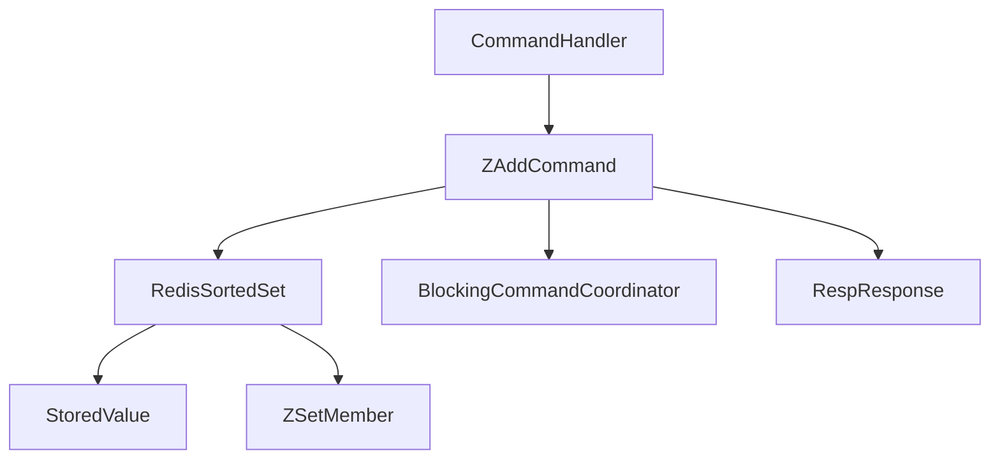

# Requirements

### Overview & Goals
The goal of this task is to complete the `ZADD` command support in the Redis implementation. While Step 1 (basic data structure) and a skeleton of `ZAddCommand` are present, they need to be completed, integrated with thread safety and replication, and thoroughly tested.

### Scope
- **In Scope:**
    - Completion of `RedisSortedSet` data structure with proper score-based sorting.
    - Implementation of `ZAddCommand` logic including locking, type checking, and key creation.
    - Integration with `ReplicationService` for persistence and replication.
    - Unit tests for `ZAddCommand` and integration tests in `CommandHandlerTest`.
- **Out of Scope:**
    - Other sorted set commands (e.g., `ZRANGE`, `ZREM`).
    - Multi-member `ZADD` (though the implementation will likely support it).
    - Complex `ZADD` options like `NX`, `XX`, `GT`, `LT`, `CH`, `INCR`.

### Functional Requirements
- `ZADD key score member` creates a sorted set if it doesn't exist.
- Returns an integer RESP response: `1` if a new member was added, `0` if it already existed.
- Scores are 64-bit doubles.
- Members are ordered by increasing scores. If scores are equal, they are ordered lexicographically.
- The command must be thread-safe and propagated to replicas.

# Technical Design

### Current Implementation
- `RedisSortedSet.java`: Exists but uses `TreeSet<String>` for sorting, which ignores scores. `ZSetMember` is defined but unused.
- `ZAddCommand.java`: Exists as a skeleton that performs basic argument count check and a flawed type check, but doesn't implement logic or locking.
- `ReplicationService.java`: Missing `"ZADD"` in `WRITE_COMMANDS`.
- `CommandHandler.java`: `"ZADD"` is already registered.

### Proposed Changes

#### 1. Data Model: `RedisSortedSet`
- Change `sortedMembers` to `TreeSet<ZSetMember>`.
- Update `add(member, score)`:
    - Check if member exists in `memberToScore`.
    - If it exists:
        - If score is different:
            - Remove old `ZSetMember` from `sortedMembers`.
            - Update `memberToScore`.
            - Add new `ZSetMember` to `sortedMembers`.
        - Return 0.
    - If it doesn't exist:
        - Put in `memberToScore`.
        - Add to `sortedMembers`.
        - Return 1.

#### 2. Command: `ZAddCommand`
- **Execution Flow:**
    1. Parse key, score, and member. Return error if arguments are insufficient or score is invalid (RESP error `-ERR value is not a valid float`).
    2. Acquire lock: `BlockingCommandCoordinator.lock().lock()`.
    3. Retrieve `StoredValue` for key.
    4. If it exists but its type is NOT `"zset"`, return `RespResponse.wrongType()`.
    5. If it doesn't exist, create a new `RedisSortedSet` and put it in `keyValuePairs`.
    6. Call `zset.add(member, score)`.
    7. Signal change: `BlockingCommandCoordinator.signalKeyChanged(key)`.
    8. Return result of `add` as RESP integer.
    9. Use a `finally` block to ensure `BlockingCommandCoordinator.lock().unlock()`.

#### 3. Integration
- `ReplicationService.java`: Add `"ZADD"` to the `WRITE_COMMANDS` set.

### File Structure
- `src/main/java/redis/storage/RedisSortedSet.java` (Modified)
- `src/main/java/redis/command/ZAddCommand.java` (Modified)
- `src/main/java/redis/server/ReplicationService.java` (Modified)
- `src/test/java/redis/command/ZAddCommandTest.java` (New)

### Architecture Diagram

# Testing

### Validation Approach
Verification will be performed by running the Redis server and using the `redis-cli` or a custom test script to send `ZADD` commands and verify the responses.

### Key Scenarios
1. **Create new sorted set:**
    - Command: `ZADD myzset 10.5 member1`
    - Expected Output: `:1\r\n`
2. **Handle wrong type:**
    - Command: `SET mykey value` followed by `ZADD mykey 10.0 member1`
    - Expected Output: `-WRONGTYPE ...` error message.
3. **Floating point precision:**
    - Command: `ZADD scores 8.2 racer1`
    - Expected Output: `:1\r\n`

### Edge Cases
- **Invalid score:** `ZADD myzset not-a-number member1` should return an error.
- **Missing arguments:** `ZADD myzset 10.0` should return an error.
- **Large scores:** Test with very large or very small floating point numbers.

# Delivery Steps

###   Step 1: Fix RedisSortedSet implementation
`RedisSortedSet` correctly maintains members in score-then-name order.

- Modify `RedisSortedSet.java`:
    - Change `sortedMembers` from `TreeSet<String>` to `TreeSet<ZSetMember>`.
    - Implement `add(String member, double score)` logic:
        - Handle existing members by updating their score (remove from `TreeSet`, update `Map`, add back to `TreeSet`).
        - Handle new members by adding to both `Map` and `TreeSet`.
        - Return `1` if member was added, `0` otherwise.

###   Step 2: Implement ZAddCommand with locking and type checking
`ZAddCommand` correctly adds members to sorted sets and handles edge cases.

- Modify `ZAddCommand.java`:
    - Implement argument parsing for key, score, and member.
    - Add error handling for invalid score format.
    - Use `BlockingCommandCoordinator.lock()` to ensure thread safety.
    - Implement type checking using `RespResponse.wrongType()` if the key holds a non-zset value.
    - Create a new `RedisSortedSet` if the key does not exist.
    - Call `zset.add(member, score)` and signal the change.
    - Return the result as a RESP integer.

###   Step 3: Integrate with replication and add tests
`ZADD` commands are propagated to replicas and verified by unit tests.

- Modify `ReplicationService.java`:
    - Add `"ZADD"` to the `WRITE_COMMANDS` set.
- Create `src/test/java/redis/command/ZAddCommandTest.java`:
    - Verify basic member addition.
    - Verify score updates for existing members.
    - Verify sorting order.
    - Verify error cases (wrong type, invalid score).