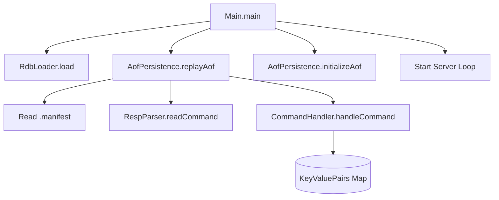

# Requirements

### Overview & Goals
The goal of this task is to implement the restoration of the server's state on startup by replaying commands from the Append-Only File (AOF). This ensures data persistence across server restarts when the `--appendonly yes` flag is provided.

### Scope
- **In Scope:**
    - Reading and parsing the AOF manifest file.
    - Identifying the incremental AOF file (type `i`) from the manifest.
    - Replaying RESP-encoded commands from the incremental file to rebuild the in-memory database.
    - Integrating the replay logic into the server startup sequence.
- **Out of Scope:**
    - Replaying other types of AOF files (e.g., base files) if they were to exist.
    - Handling AOF file rotation or rewriting (not required for this stage).

# Technical Design

### Current Implementation
- The server currently supports AOF persistence via `AofPersistence.appendToAof`, which writes commands to an incremental file specified in a manifest.
- The startup sequence in `Main.java` initializes AOF and loads RDB files, but does not yet replay AOF commands.
- `RespParser` is used to parse RESP commands from client connections, and it can be reused for reading AOF files.

### Proposed Changes

#### 1. Refactor `AofPersistence.java`
- Extract manifest parsing logic into a private helper method `getIncrementalFileName`.
- Implement `replayAof` method:
    - Locates the incremental file based on the manifest.
    - Uses `RespParser` to read commands from the file.
    - Uses `CommandHandler` to execute these commands against the in-memory `keyValuePairs` map.
    - Pass `OutputStream.nullOutputStream()` to `CommandHandler` as we don't need to send responses back to a client during replay.

#### 2. Update `Main.java`
- Inject the `replayAof` call into the `main` method.
- The optimal order for restoration is:
    1. Load RDB (if exists).
    2. Replay AOF (if enabled and exists).
    3. Initialize AOF (ensure files/directories exist for new writes).
    4. Start replication/listening.

### File Structure Changes
- `src/main/java/redis/persistence/AofPersistence.java`: Added `replayAof` and helper methods.
- `src/main/java/Main.java`: Added call to `replayAof` during startup.

### Architecture Diagram

# Testing

### Validation Approach
Verification will be performed by ensuring the server correctly restores state from a pre-existing AOF file provided by the tester.

### Key Scenarios
1. **Successful Replay:**
    - Start server with `--appendonly yes`.
    - Manifest and incremental AOF file (with a `SET` command) exist.
    - Verify that a `GET` command returns the value from the `SET` command.
2. **Follow Manifest Filename:**
    - Ensure the server reads the filename specified in the manifest, even if it's not the default name (e.g., `<random_file_name>.1.incr.aof`).
3. **Empty/Missing AOF:**
    - Ensure the server starts correctly if AOF is enabled but no files exist yet.

### Edge Cases
- Malformed AOF manifest.
- Malformed RESP commands in the AOF file.
- Empty manifest or manifest with no incremental file entry.

# Delivery Steps

### ✓ Step 1: Refactor manifest parsing in AofPersistence
Extract the manifest parsing logic into a reusable helper method in `AofPersistence.java`.
- Create a private method `getIncrementalFileName(Path manifestFilePath)` that reads the manifest and returns the name of the file with type `i`.
- Update the existing `appendToAof` method to use this helper.
- Ensure appropriate error handling for file I/O operations.

### ✓ Step 2: Implement AOF replay logic
Implement the AOF replay logic in `AofPersistence.java`.
- Add a public static method `replayAof(ServerConfig serverConfig, Map<String, StoredValue> keyValuePairs, ReplicationService replicationService)`.
- Use `getIncrementalFileName` to find the AOF file to replay.
- Create a `RespParser` to read RESP commands from the AOF file.
- Use `CommandHandler` with a null output stream to execute each command and restore the state in `keyValuePairs`.
- Add necessary imports for `OutputStream`, `Map`, `StoredValue`, `ReplicationService`, `CommandHandler`, and `RespParser`.

### ✓ Step 3: Integrate AOF replay into server startup
Integrate the AOF replay into the server startup sequence in `Main.java`.
- Call `AofPersistence.replayAof` after the RDB file has been loaded.
- Ensure the replay happens before `ReplicationHandshakeHandler.run()` and `AofPersistence.initializeAof()`.
- This ensures that the server's state is fully restored from both RDB and AOF before it starts accepting new connections or interacting with a master.