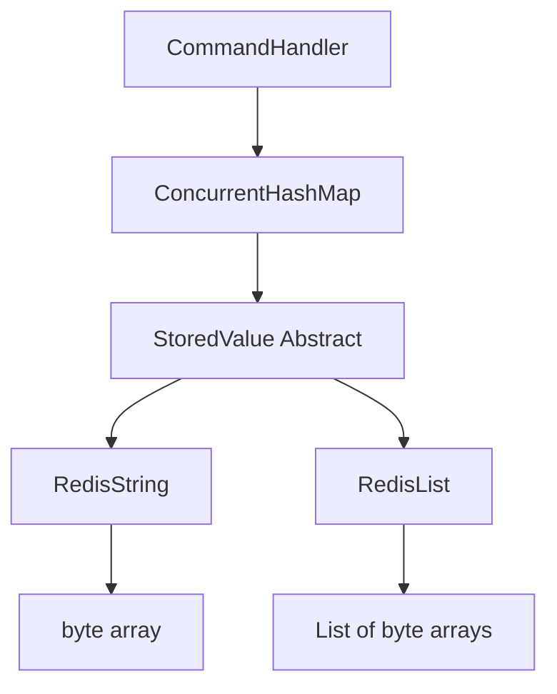

# Requirements

### Overview & Goals
The goal is to implement the `RPUSH` command, which allows clients to append elements to a list. This requires expanding the server's internal storage model to support multiple data types beyond just simple strings.

### Scope
- **In Scope:**
    - Refactoring internal storage to support polymorphism.
    - Implementing `RPUSH <key> <element>` for new lists.
    - Returning the list length as a RESP integer.
- **Out of Scope:**
    - Handling `RPUSH` for existing lists (deferred to later stages).
    - Handling multiple elements in a single `RPUSH` call.
    - List-specific expiration (Redis typically sets expiration on the key, not individual elements).

# Technical Design

### Current Implementation
- `StoredValue` is a single class holding a `byte[]`.
- `CommandHandler` handles `GET`/`SET` by assuming every value is a byte array.
- All responses are currently Simple Strings, Bulk Strings, or Errors.

### Key Decisions
- **Polymorphic Storage:** We will use an abstract `StoredValue` with subclasses (`RedisString`, `RedisList`). This mirrors Redis's internal "object" system and makes it easy to add Hashes or Sets later.
- **Type-Safe Command Handling:** Since commands like `GET` are type-specific, we will use Java's pattern matching (`instanceof`) to safely check types and return a `WRONGTYPE` error if the command is called on the wrong data structure.
- **RESP Integer Encoding:** The `RPUSH` command returns an integer. We need to implement the `:` prefix format for RESP integers.

### Proposed Changes
- **Storage Layer:**
    - `StoredValue.java`: Change to `abstract class`.
    - `RedisString.java`: New class extending `StoredValue` for string data.
    - `RedisList.java`: New class extending `StoredValue` for list data. Should include a `size()` method for `RPUSH` return value.
- **Command Handling:**
    - `CommandHandler.java`: Update `GET` to use pattern matching for `RedisString` and handle `WRONGTYPE` errors.
    - `CommandHandler.java`: Add `RPUSH` logic that creates a `RedisList` (if missing) or appends to an existing one.

### File Structure
- `src/main/java/redis/storage/StoredValue.java` (modified)
- `src/main/java/redis/storage/RedisString.java` (new)
- `src/main/java/redis/storage/RedisList.java` (new)
- `src/main/java/redis/command/CommandHandler.java` (modified)

### Architecture Diagram

# Testing

### Validation Approach
- Use the CodeCrafters tester or `redis-cli` to verify the command.
- Ensure that `RPUSH` returns a RESP integer (starts with `:`).

### Key Scenarios
- **New List:**
    - Input: `RPUSH mylist item1`
    - Expected Response: `:1\r\n`
    - Internal State: Key `mylist` maps to a `RedisList` containing one element.

### Edge Cases
- **Type Mismatch:** If `GET` is called on a key containing a `RedisList`, it should return: `-WRONGTYPE Operation against a key holding the wrong kind of value\r\n`.
- **Existing Keys:** If `RPUSH` is called on a key containing a `RedisString`, it should also return a `WRONGTYPE` error.

# Delivery Steps

###   Step 1: Refactor Storage for Polymorphism
Refactor the storage layer to support different Redis data types and update existing commands.
- Convert `StoredValue` into an `abstract` class.
- Implement `RedisString` and `RedisList` subclasses.
- Update `SET` to store `RedisString`.
- Update `GET` to use pattern matching (`instanceof RedisString rs`) to retrieve the value or return a `WRONGTYPE` error if the key holds a list.

###   Step 2: Implement RPUSH Command Logic
Register and implement the logic for the `RPUSH` command.
- Add `RPUSH` to the `CommandHandler` constructor.
- Extract `key` and `element` from arguments.
- Retrieve the existing `StoredValue`:
    - If it's `null`, create a new `RedisList`, add the element, and store it.
    - If it's a `RedisList`, append the element.
    - If it's a `RedisString`, return a `WRONGTYPE` error.

###   Step 3: Format and Return RESP Integer Response
Return the result of the `RPUSH` operation in the correct format.
- Calculate the size of the list after the append operation.
- Implement a helper method (or use inline logic) to format an integer as a RESP integer (e.g., `":<length>\r\n"`).
- Return this byte array as the command response.