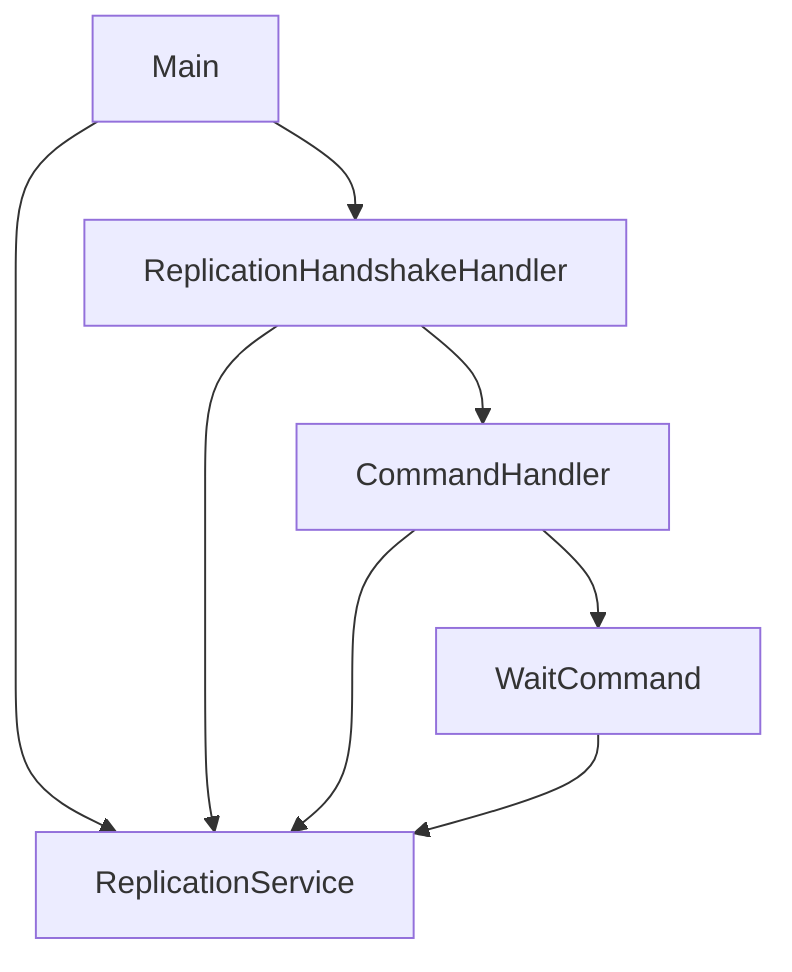

# Plan: Implement WAIT Command (Simplest Case) Validation and Testing

Support the `WAIT` command on the Redis master for the simplest case. This plan includes validating the existing implementation, fixing compilation issues, and adding automated tests.

### ✓ Step 1: Expose replica count in ReplicationService
- Add `getReplicaCount()` method to `ReplicationService.java`.
- Ensure it is thread-safe using the existing lock.

### ✓ Step 2: Fix compilation errors in ReplicationHandshakeHandler and Main.java
- Update `ReplicationHandshakeHandler` constructor to accept `ReplicationService`.
- Pass `replicationService` to `CommandHandler` in `ReplicationHandshakeHandler`.
- Update `Main.java` to provide `ReplicationService` to `ReplicationHandshakeHandler`.

### ✓ Step 3: Implement/Verify WaitCommand logic
- Ensure `WaitCommand` correctly uses `replicationService.getReplicaCount()`.
- Verify `WaitCommand` returns the count as a RESP integer.

### ✓ Step 4: Update tests and verify implementation
- Fix compilation errors in `ReplicationPropagationTest.java`, `ReplicationHandshakeTest.java`, and `UnWatchCommandTest.java`.
- Add missing `replicationService` field to `CommandHandlerTest`.
- Add `testHandleWaitCommand` to `CommandHandlerTest`.
- Run tests and ensure they pass.

## Proposal Tabs

### Requirements
#### Overview & Goals
- Validate and fix the implementation of the `WAIT` command.
- Ensure the project compiles successfully and all tests pass.
- Add comprehensive unit tests for the `WAIT` command in `CommandHandlerTest`.

#### Scope
- **In Scope**:
    - Fixing compilation errors in `ReplicationHandshakeHandler`, `Main`, and `CommandHandlerTest` caused by `CommandHandler` constructor changes.
    - Adding `WAIT` command test cases to `CommandHandlerTest`.
    - Ensuring `WAIT` returns the correct count of connected replicas.
- **Out of Scope**:
    - Implementing blocking behavior and timeout handling for `WAIT` (future stage).
    - Tracking command acknowledgments (ACKs) from replicas (future stage).

#### Functional Requirements
- `WAIT <numreplicas> <timeout>` should return the current number of connected replicas as a RESP integer.
- Specifically, for `WAIT 0 60000`, the server should return `0` immediately if no replicas are connected.

### Technical Design
#### Current Implementation
- `CommandHandler` constructor was updated to require a `ReplicationService`.
- `WaitCommand` is implemented to return `replicationService.getReplicaCount()`.
- Several classes (`ReplicationHandshakeHandler`, `CommandHandlerTest`) and `Main.java` were not correctly updated to provide the `ReplicationService` dependency.

#### Proposed Changes
- **`ReplicationHandshakeHandler`**:
    - Update constructor to accept `ReplicationService`.
    - Pass `replicationService` to `CommandHandler` in `handleMasterCommands`.
- **`Main.java`**:
    - Pass the `replicationService` instance to `ReplicationHandshakeHandler`.
- **`CommandHandlerTest`**:
    - Add missing `replicationService` field and import.
    - Add `testHandleWaitCommand` to verify `WAIT` command returns correct replica count.
- **`WaitCommand`**:
    - No changes needed to logic, but ensure it's correctly integrated.

#### Architecture Diagram

### Testing
#### Validation Approach
- Verify that `mvn compile` succeeds.
- Run `mvn test -Dtest=CommandHandlerTest` and ensure all tests pass.

#### Key Scenarios
1. **No replicas connected**:
    - Send `WAIT 0 60000`.
    - Expect `:0\r\n`.
2. **One replica connected**:
    - Manually add a replica to `ReplicationService` in a test.
    - Send `WAIT 0 60000`.
    - Expect `:1\r\n`.